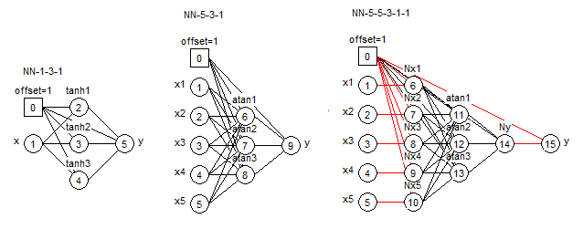

```{r, echo=FALSE}
library(knitr)
library(kableExtra)
```


## Abstract

In the last three decades, neural networks (NN) have evolved from an academic topic to a common scientific computing tool. 
CRAN currently hosts approximately 80 packages in May 2020 involving neural network modeling, some offering more than one algorithm. 
However, to our knowledge, there is no comprehensive study which checks the accuracy, the reliability
and the ease-of-use of those NN packages.

<!-- JN??: changed "the" to "a" common set,
==> B, CD : agree -->

In this paper, we attempted to test this rather large number of packages against a common set of datasets with different levels of complexity, and to benchmark and rank them with certain metrics.

Restricting our evaluation to regression algorithms applied on the one-hidden layer perceptron and ignoring those for classification or other specialized purposes, there were approximately 60 package::algorithm pairs left to test. 
The criteria used in our benchmark were: (i) the accuracy, i.e. the ability to find the global minima on 13 datasets, measured by the Root Mean Square Error (RMSE) in a limited number of iterations; (ii) the speed of the training algorithm; (iii) the availability of helpful utilities; (iv) and the quality of the documentation.

We have attempted to give a score for each evaluation criterion and to rank each package::algorithm pair in a global table. Overall, 15 pairs are considered accurate and reliable and can be recommended for daily usage. 
Most others should be avoided as they are either less accurate, too slow, too difficult to handle, or have poor or no documentation.

To carry out this work, we developed various codes and templates, as well as the NNbenchmark package used for testing.
This material is available at https://akshajverma.com/NNbenchmarkWeb/index.html and https://github.com/pkR-pkR/NNbenchmark, and can be used to verify our work and, we hope, improve both packages and their evaluation.
Finally, we provide some hints and features to guide the development of an idealized neural network package for R.


## Introduction


The R Project for Statistical Computing (\url{www.r-project.org}), as any opensource platform, relies on its contributors to keep it up to date. 
Neural networks (NN), inspired on the brain's own connections system, are a class of models in the growing field of machine learning for which R has a number of tools.
During the last 30 years, neural networks have evolved from an academic topic to a common tool in scientific computing.
Previously, neural networks were considered more theory than practice, partly because the algorithms used were computationally demanding. 

As a convenience in the general conversation, the same term is used in a generic manner for different model structures and applications: multilayer perceptron for regression, multilayer perceptron for classification, multilayer perceptron for specialized applications, recurrent neural network for autoregressive time series, convolutional neural networks for dimension reduction and pattern recognition, deep neural networks for image or voice recognition.
Most of the above types of neural networks can be found in R packages hosted on CRAN but without any warranty about the accuracy or the speed of computation.
This is an issue as many poor algorithms are available in the literature and hence poor packages implemented on CRAN.

A neural network algorithm requires complicated calculations to improve the model control parameters. As with other optimization problems, the gradient of the chosen cost function that indicates the lack of suitability of the model is sought. 
This lets us improve the model by changing the parameters in the negative gradient direction. Parameters for the model are generally obtained using part of the available data (a training set) and tested on the remaining data. 
Modern software allows much of this work, including approximation of the gradient, to be carried out without a large effort by the the user. 

The training process can generally be made more efficient if we can also approximate second derivatives of the cost function, allowing us to use its curvature via the Hessian matrix. 
There are a large number of approaches, of which quasi-Newton algorithms are perhaps the most common and useful. 
Within this group, methods based on the Broyden-Fletcher-Goldfarb-Shanno (BFGS) algorithm for updating the (inverse) Hessian approximation provide several well-known examples. 
In conducting this study, we believed that these second-order algorithms would perform better than first-order methods for fit-in-memory datasets. 

Regardless of our belief, we wished to be able to conduct a thorough examination of these training algorithms in R. 
There are many packages, but barely any information to allow comparison. 
Our work, reported here, aims to provide a framework for benchmarking neural network packages. 
We restrict our examination to packages for R, and in this report focus on those that provide neural networks of the perceptron type, that is, one input layer, one normalized layer, one hidden layer with a nonlinear activation function that is usually the hyperbolic tangent 
$\tanh()$, and one output output layer. 
The criteria used in our benchmark were: (i) the accuracy, i.e. the ability to find the global minima on 13 datasets in a limited number of iterations; (ii) the speed of the training algorithm; (iii) the availability of helpful utilities; (iv) and the quality of the documentation.
We restricted our evaluation to regression algorithms applied on the one-hidden layer perceptron and ignored those for classification or other specialized purposes. 


# Neural Networks: the perceptron

Here, we give a short description of the one hidden layer perceptron. As the "layer" term suggests it, some terms come from the representation of graphs whereas some other terms come from the  traditional literature on nonlinear models. 

Using the graph description, a one-hidden layer neural network is made of 3 parts: (i) the layer of the input(s), (ii) the hidden layer which consists of independant neurons, each of them performing two operations: a linear combination of the inputs plus an offset, then a nonlinear function applied on this linear combination. (iii) the layer of the output(s) which is a linear combination of the output of the nonlinar functions in the hidden layer. 

<!-- JN??: differentiable rather than derivable
==> CD: agree -->

The nonlinear function used in the hidden layer must have the following four properties: continuous, differentiable, monotonic, bounded. The logistic ($\invlogit$), the hyperbolic tangent ($\tanh$) and the arctangent ($\atan$) functions are the usual candidates. 

The above description has a simple mathematical equivalence. Let us give two examples. 

The model $y = a_1 + a_2\times \tanh(a_3 + a_4\times x) + a_5\times \tanh(a_6 + a_7\times x) + a_8\times \tanh(a_9 + a_{10}\times x)$ describes a neural network (Fig. 1 left) with one input, three hidden neurons, one output model where $x$ is the input, $\tanh()$ is the activation function, $y$ is the output and $a_1,\dots,a_{10}$ are the parameters. 

The model $y = a_1 + a_2\times \atan(a_3 + a_4\times x_1 + a_5\times x_2 + a_6\times x_3 + a_7\times x_4 + a_8\times x_5) + a_9\times \atan(a_{10}  + a_{11}\times x_1 + a_{12}\times x_2 + a_{13}\times x_3 + a_{14}\times x_4 + a_{15}\times x_5) + a_{16}\atan(a_{17} + a_{18}\times x_1 + a_{19}\times x_2 + a_{20}\times x_3 + a_{21}\times x_4 + a_{22}\times x_5)$ describes a neural network (Fig. 1 middle) with five inputs, three hidden neurons, one output model where $x$ is the input, $\text{atan}()$ is the activation function, $y$ is the output and $a_1,\dots,a_{22}$ are the parameters. 

In order to get large gradients at the first steps of the training algorithm, it is recommended to use normalized inputs and normalized outputs (Fig. 1 right), odd functions like the hyperbolic tangent function or the arctangent function and small random values to initialize the parameters, for instance extracted from a centered Gaussian $\mathcal N(0, 0.1)$ distribution. 
Such good practices help find good local minima and possibly the global minimum. 


<!-- 


CD: the below solution could be improved by removing title in png files?
-->


\begin{figure}
    \centering
    \begin{subfigure}[b]{0.26\textwidth}
        \includegraphics[width=\textwidth]{RN3a.png}
        \caption{NN 1-3-1}
        \label{fig:N131}
    \end{subfigure}
    ~ 
    \begin{subfigure}[b]{0.26\textwidth}
        \includegraphics[width=\textwidth]{RN3b.png}
        \caption{NN 5-3-1}
        \label{fig:N531}
    \end{subfigure}
    ~ 
    \begin{subfigure}[b]{0.43\textwidth}
        \includegraphics[width=\textwidth]{RN3c.png}
        \caption{NN 5-5-3-1-1}
        \label{fig:N55311}
    \end{subfigure}
    \caption{Three neural networks}
\end{figure}


The dataset used for the training is assumed to have a number of rows much larger than the number of parameters. While "much larger" is subject to discussion, values of 3 to 5 are generally accepted (in experimental design, some iterative strategies start with a dataset having a number of distinct experiments equal to 1.8 times the number of parameters and then increase the number of experiments to finetune the model).

It is rather clear from the mathematical formula above that neural networks of perceptron type are nonlinear models and require for their parameter estimation some training algorithms that can handle (highly) nonlinear models. Indeed, the intrinsic and parametric curvatures of such models are usually very high and, with so many parameters, the Jacobian matrix might exhibit some collinearities between its columns and become nearly singular. As a result, appropriate algorithms for such dataset::model pairs are rather limited and well-known. They pertain to the class of the second-order algorithms and are the BFGS algorithm which is Quasi-Newton in how it approximates the Jacobian matrix and the Levenberg-Marquardt algorithm which stabilizes the Gauss-Newton (Hessian matrix ?) at every iteration.


<!--Also Levenberg-Marquardt is a stabilization of the Jacobian that could be applied to several algorithms. Should we say 'Levenberg-Marquardt stabilized Gauss-Newton', which is what \CRANpkg{nlsr} uses.
SB??: JN, I did not add this here as there is some discussion of the package side of things in the results, I did however add the point about LM stabilizing Gauss-Newton-->
      
<!-- Unfortunately, due to some simple literature on the gradient and the hype around ``deep neural networks'' that manipulate ultra-large models with hundreds or thousands parameters and sometimes more parameters than examples in the datasets, many papers and many R packages emphasize the use of first-order gradient algorithms. In the case of the perceptron, this is an error and the goal of this paper is to demonstrate it.  -->

<!-- JN??: replace previous paragraph with ?? -->
      
<!-- 
Unfortunately, there are widely-discussed articles concerning the gradient and ``deep neural networks'' that manipulate ultra-large models with hundreds or thousands parameters and sometimes more parameters than examples in the datasets.
These, along with some R packages, emphasize the use of first-order gradient algorithms. In the case of the perceptron, 
we contend this is an error, and provide evidence to that effect in this paper.
  -->

<!-- PK??: I suggest this new version ?? -->
Unfortunately, due to some educative tools on the backpropagation and an initial literature on the gradient in the early researchs and more recently on the "deep neural networks" that manipulate ultra-large models with hundreds or thousands parameters and sometimes more parameters than examples in the datasets, many papers emphasize the use of first-order gradient algorithms and many R packages have implemented such algorithms. In the case of the perceptron, we contend this is an error, and provide evidence to that effect in this paper.


# Methodology


<!-- to be removed -->
<!-- **- What does ``convergence'' mean in our context?** -->
<!-- **??JN: Something like** -->

## Convergence and termination

Most of the package:algorithm pairs try to minimize the root mean squared error (RMSE) during the training step. Two exceptions are the brnn package which minimizes the RMSE plus the sum of the parameters, hence the name Bayesian Regularized Neural Network, and the qrnn package which performs quantile regression. For all packages, the datasets were learnt as a whole and without any weighting scheme to favour one part of the datasets. There was no validation subset or test subset as the purpose of our study is just to verify the ability to reach good minima. 

When training neural networks, we attempt to tune a set of hyperparameters so that the root 
mean squared error (RMSE) is minimized. 
When our method for such adjustment can no longer reduce the RMSE, we say that the given algorithm terminated.
We consider the method to have **converged** when termination is not due to some exceptional situation 
and the final RMSE value is 
relatively small^[We do not choose the mean absolute error (MAE) for overall ranking nor for convergence testing as there is
a lack of consensus in the literature,  see e.g. \citep{willmott2005advantages,chai2014root}.].
In practice, some algorithms require that we stop the optimization process in 
exceptional situations (e.g., a divide by zero), or a pre-set limit on the number of steps or a maximum elapsed
time is reached.

More precisely, second-order algorithms are all set to a maximum of 200 iterations. 
On the other hand, first-order algorithms were set to several values, depending on how well and how fast they converged: `maxit1storderA=1000` iterations, `maxit1storderB=10000` iterations, and `maxit1storderC=100000` iterations.
The full list of the maximum iteration number per package:algorithm is given in Appendix C. It can be seen that we were unable to completely harmonize the hyperparameters as an appropriate learning rate differed between packages, despite the algorithm being similarly named.


<!-- to be removed -->
<!-- **- What do we mean by ``performance''? Other goals?** -->
<!-- **??JN: perhaps?** -->

## Performance

We measure **performance** primarily by relative computing time between methods on a particular computing 
platform. We could also count measures of iterations, function evaluations or similar quantities that
indicate the computing effort. We note that differences in machine architecture and in the attached
libraries (e.g., BLAS choices for R) will modify our measures. We are putting our tools on a
Github repository so that further evaluation can be made by ourselves and others as hardware and software
evolves.

The resulting files in our repository were mostly generated by one of us (SM) on a Windows system build 
10.0.18362.752 with an i7-8750H CPU, an Intel(R) UHD Graphics 630 and NVIDIA GeForce GTX 1060 chip, and
16 GB of RAM.
<!-- B: if we talk about platforms, do we have to mention the ones we used? For example, using a particular 
GPU card with keras. Well I suppose this is better mentioned in the results
==> CD : yes Bila you need to put your laptop configuration. 
==> B: I've put it here for reference -->


<!-- JN??: Can I get some guidance of what to include/exclude in rest of this section? -->

<!-- B: Basically,
1. Introduce datasets, explain process of finding packages
2. Results of reviewing and testing - explain how we got the result files with metrics (the template) & ease of use scores
3. How we then ranked the results of speed and accuracy -> note, I didn't rank the ease of use and its per package, which might be why Christophe noted those as individual scores not global scores
-->

<!-- Our research process was divided into 3 phases. -->

## Phase 1 - Preparation of benchmark datasets

### Datasets
<!-- => NEED TO BE FINISHED?? -->

A non-iterative calculation such as Ordinary Least Squares cannot generally be used to model all
the datasets in our evaluation set. Varying levels of difficulty in modeling the
different data sets are intended to allow us to further classify different algorithms and the packages
that implement them. Sonja Surjanovic and Derek Bingham of Simon Fraser University created a useful website 
from which three of the multivariate datasets were drawn. We note the link, name and difficulty level of 
the three datasets:  
- http://www.sfu.ca/~ssurjano/fried.html        (Friedman - average)  
- http://www.sfu.ca/~ssurjano/detpep10curv.html (Dette - medium)  
- http://www.sfu.ca/~ssurjano/ishigami.html     (Ishigami - high)  

The other multivariate dataset, Ref153, was taken from ... ??JN: Need this. Bila?

Three of the univariate datasets we used were taken from a website of the US National Institute
for Standards and Technology (NIST):
https://www.itl.nist.gov/div898/strd/nls/nls_main.shtml. (Gauss1 - low; Gauss2 - low; Gauss3 - average)

Univariate datasets Dmod1, Dmod2 are from ... ??JN: Need this. Bila?

Dreyfus1 is a pure neural network which has no error. This can make it difficult for algorithms 
that assume an error exists. Dreyfus2 is Dreyfus1 with errors.
NeuroOne  from ...  

Finally, we also consider a Simon Wood test dataset, used in 
\citep{wood2011fast} for benchmarking generalized additive models. 
Precisely, we consider a generation of Gaussian random variates $Y_i$, $i=1,\dots,n$ with the mean $\mu_i$ defined as
$$
\mu_i = 1+ f_0(x_{i,0})+f_1(x_{i,1})+f_2(x_{i,2})+f_3(x_{i,3})
+f_4(x_{i,4})+f_0(x_{i,5})
$$
and standard deviation $\sigma=1/4$ where $f_j$ are Simon Wood's smooth 
functions defined in Appendix B, $x_{i,j}$ are uniform variates and $n=20,000$.


### Packages

Using \CRANpkg{RWsearch} \citep{R-RWsearch} we sought to automate the process of searching for neural network packages. 
All packages that have ``neural network'' as a keyword in the package title or in the package description were included. 
In May 2020, around 80 packages falls into this category.
Packages \pkg{nlsr}, \pkg{minpack.lm}, \pkg{caret} were added because the former 2 are important implementations of second-order algorithms while the latter is the first cited meta package in 
the CRAN's task view for machine learning, 	https://CRAN.R-project.org/view=MachineLearning, as well as the dependency for some of the other packages tested. 
Restricting to regression analysis left us with 49 package::algorithm pairs in 2019 and 60 package::algorithm pairs in 2020.


<!-- B??: basically, each package was inspected 3 times:
==> CD: this should be put here in the paper
==> B: just merged it
-->


## Phase 2 - Review of packages and development of a benchmarking template

From documentation and example code, we learned that not all packages selected by the automated 
search fit the scope of our research. Some have no function to generate neural networks. 
Others were not regression neural networks of the perceptron type or 
were only intended for very specific purposes. Basically, each package was inspected 3 times.

1. The discard/not discard phase: depending on the package, this could be decided as easily as looking at
the DESCRIPTION file or having to go through the process of making the code and seeing the results.

2. Benchmarking with template that was developed in 2019 and encapsulated in the functions of 2020, keeping
notes of whether or not the package was easy to use.

**Templates for Testing Accuracy and Speed** 

As we inspected the packages, we developed a template for benchmarking. The structure of this
template (for each package) is as follows:  

1. Set up the test environment - loading of packages, setting working directory and options; 
2. Summary of tested datasets; 
3. Loop over datasets: 
      a. setting parameters for a specific dataset, 
      b. selecting benchmark options, 
      c. training a neural network with a tuned functions for each package, 
      d. calculation of convergence metrics (RMSE, MAE, WAE)^[We measure the quality of our model by RMSE, but the mean absolute error (MAE) and the worst absolute error (WAE) may help distinguish packages with close RMSE values. See Appendix A for definition of convergence metrics.],
      e. plot each training over one initial graph, then plot the best result, 
      f. add results to the appropriate existing record (*.csv file) and 
      g. clear the environment for next loop.
4. Clearing up the environment for the next package.
It is optional to print warnings.

To simplify this process, we developed tools in the \pkg{NNbenchmark} package, of which the first version 
was created as part of GSoC 2019. In GSoC 2020, 3 functions encapsulating the template, that had been 
made generic with an extensive use of the incredible \code{do.call} function, were added:

1.    In \code{trainPredict\_1mth1data} a neural network is trained on one dataset and then used for predictions, with several utilities. Then, the performance of the neural network is exported, plotted and/or summarized.
2.    \code{trainPredict\_1data} serves as a wrapper function for trainPredict_1mth1data for multiple methods.
3.    \code{trainPredict\_1pkg} serves as a wrapper function for trainPredict_1mth1data for multiple datasets.

A function for the summary of accuracy and speed, \code{NNsummary}, was also added. The package repository is https://github.com/pkR-pkR/NNbenchmark, with package templates in https://github.com/pkR-pkR/NNbenchmarkTemplates. 

<!-- B??: should we add some examples with the code? As some package authors who publish in the R Journal do to introduce their package. Or we could link to specific pages of the website here?
==> CD: maybe we can put one example in Appendix but not in the body 
==> B: added an example with nnet
==> CD: perfect -->

3. summarizing or re-reviewing the tested packages utility functions & documentation

**Ease of Use Scoring**

We define an ease-of-use measure based on what we considered a user would need when using a neural network 
package for nonlinear regression, namely, utility functions and sufficient documentation. 

1. Utilities (1 star)
    a. a predict function exists 
    b. scaling capabilities exist
2. Sufficient documentation (2 stars)
    a. the existence of useful example/vignette = (1 star)
        - clear, with regression = 2 points
        - unclear, examples use iris or are for classification only = 1 point
        - no examples = 0 points
    b. input/output is clearly documented, e.g., what values are expected and returned 
    by a function = (1 star)
        - clear input and output = 2 points
        - only one is clear = 1 point
        - both are not documented = 0 points

The ease-of-use measure ranges from 0 to 3 stars.

## Phase 3 - Collection of and analysis of results

### Results collection

Looping over the datasets using each package template, we collected results in the relevant package 
directories in the templates repository. 


### Analysis

To rank how well a package converged and its speed, we developed the following method:

1.	The results datasets are loaded into the R environment as one large list. The dataset names, package:algorithm names and all 10 run numbers, durations, and RMSE are extracted from that list.
2.	For the duration score (DUR), the duration is averaged by dataset. 3 criteria for the RMSE score by dataset are calculated: 
    a.	The minimum value of RMSE for each package:algorithm as a measure of their best performance;
    b.	The median value of RMSE for each package:algorithm as a measure of their average performance, without the influence of outliers;
    c.	The spread of the RMSE values for each package which is measured by the difference between the median and the minimum RMSE (d51).

3.	Then, the ranks are calculated for every dataset and the results are merged into one wide dataframe.
    a.	The duration rank only depends on the duration;
    b.	For minimum RMSE values, ties are decided by duration mean, then the RMSE median;
    c.	For median RMSE values, ties are decided by the RMSE minimum, then the duration mean;
    d.	The d51 rank only depends on itself.
  
<!-- B: to be precise - dfrRMSE <- dfr[order(dfr$RMSE.min, dfr$time.mean, dfr$RMSE.med),], so the RMSE score is the results of ranking by RMSE.min, if there is a tie then by time, if there is a tie then by median RMSE. -->


4.	A global score for all datasets is found by a sum of the ranks (of duration, minimum RMSE, median RMSE,  d51 RMSE) of each package:algorithm for each dataset.
5.	The final table is the result of ranking by the global minimum RMSE scores for each package:algorithm.


To rank how easy or not a package was to use (TO BE DISCUSSED FURTHER):
- Functionality (util): scaling, input, output, trace
- Documentation (docs): examples, structure/functions, vignettes

# Results

Table 1 gives the RMSE and time score per package and per algorithm. The full list of score
is given in Table 2 in Appendix C.

**Tables**


<!-- B??: would you prefer this ranked by RMSE score or alphabetically as it is now? -->
<!-- B: if I'm not mistaken Christophe responded saying its better to rank -->
<!-- B: but now that I see the output again, I wonder if we should do so? bcs then packages with more than 1 algorithm will be separated + in Appendix C, the authors would have to remember multiple numbers as the names don't fit. At least alphabetically, -->

```{r echo=FALSE, message=FALSE}
library(kableExtra)
options(knitr.kable.NA = '')

if(file.exists("./tables/Table1.csv")) {  
  Table1 <- read.csv("./tables/Table1.csv", sep = ";")
  Table1 <- Table1[Table1[,2] != "", ]
}


# else if(file.exists("./tables/Table1.csv"))
# {  
#   Table1 <- read.csv("D:/DevGSoC/Packages/NNbenchmarkArticle/input/tables/Table1.csv", sep = ";")
#   Table1 <- Table1[Table1[,2] != "", ]
# }else if(file.exists("~/Documents/recherche-enseignement/code/R/NNbenchmark-project/NNbenchmarkArticle/input/tables/Table1.csv"))
# {  
#   Table1 <- read.csv("~/Documents/recherche-enseignement/code/R/NNbenchmark-project/NNbenchmarkArticle/input/tables/Table1.csv", sep = ";")
#   Table1 <- Table1[Table1[,2] != "", ]
# }

# else 
#   Table1 <- rep("missing",2)

colnames(Table1) <- c("Package", "Algorithm", "Time", "RMSE",
                    "Util", "Doc")

pkg.name <- Table1$Package[Table1$Package != ""]
idx.pkg.name <- (1+0:NROW(Table1))[Table1$Package != ""]
#repeate value
Table1$Package <- rep(pkg.name, times=diff(idx.pkg.name))
Table1$Util <- rep(Table1$Util[!is.na(Table1$Util)], times=diff(idx.pkg.name))
Table1$Doc <- rep(Table1$Doc[!is.na(Table1$Doc)], times=diff(idx.pkg.name))
#reorder columns => is that OK?
Table1 <- Table1[, c(1, 5:6, 2:4)]

kableExtra::kable(Table1, format = "latex", booktabs = TRUE, 
                  centering = TRUE, align="lcclcc",
                  caption="Result from Tested Packages") %>%
  add_header_above(c(" "=1, "Individual score"=2, " "=1,  "Global score"=2)) %>%
  column_spec(1, bold = TRUE) %>%
  collapse_rows(columns = 1, latex_hline = "major", valign ="middle") %>%
  kable_styling(font_size=7)
```


## Discussion and Recommendations

<!-- I think from Patrice: For the comments per package, I suggest one small text per package, at least for the best 12/15 packages, and some text for the significant bad or painful packages like tensorflow, keras, h2o. etc. -->

<!-- (NOTE TO MENTORS: based on latest 2020 Run 04 with corrections) -->

### 2nd order algorithms
Out of all the algorithms, the following second algorithms generally performed better in terms of convergence despite being set to a much lower number of iterations, to be precise a fifth or even less, than the first-order algorithms. 

An important finding is that 11 out of 15 of these package::algorithms use the algorithms included in \code{optim} from \CRANpkg{stats}. 2 of them, \CRANpkg{CaDENCE}'s BFGS \citep{R-CaDENCE} and \CRANpkg{validann}'s BFGS and L-BFGS-B \citep{R-validann}, do so with no intermediate package. 
However, it is not clearly stated in \CRANpkg{CaDENCE}'s documentation that optim's BFGS algorithm is used and not one of the other algorithms. 
Furthermore, the mention of Nelder-Mead in the documentation might lead users to believe that \code{optim}'s Nelder-Mead is used instead. 
Speed and variation between results are also not as good as other package's that use \code{optim}. 
This could be because \CRANpkg{CaDENCE} is intended for probabilistic nonlinear models with a full title of ``Conditional Density Estimation Network Construction and Evaluation''. 
On the other hand, \CRANpkg{validann} is clearly a package that allows a user to use all optim's algorithms. \CRANpkg{validann}::L-BFGS-B ranks lower than \CRANpkg{validann}::BFGS in just about everything for most runs, despite the former being more sophisticated. 
This is probably due to our efforts to harmonize parameters under-utilizing the possibilities of the L-BFGS-B algorithm. 
Both \CRANpkg{CaDENCE} and validann's BFGS are outperformed by \CRANpkg{nnet}, especially in terms of speed.

\CRANpkg{nnet} \citep{R-nnet} differs from the two packages because it uses the C code  from \code{optim} (converted earlier from Fortran) instead of calling optim from R. It also only implements the BFGS algorithm. 
This could be what allows it to be faster. 
\CRANpkg{nnet} is only beaten by the Extreme Learning Machine (ELM) algorithms in terms of speed. 
However, there is a larger variation between results (see the `RMSEd51` in Appendix C) in comparison to \CRANpkg{validann}::BFGS. 
Most likely, the different default values are the cause of this. 
For instance, \CRANpkg{nnet} uses a range of initial random weights of 0.7 while \CRANpkg{validann} uses a value of 0.5. 
In spite of these results, the real reason most authors or users are likely to choose \CRANpkg{nnet} is because it ships with base R and is even mentioned as the very first package in CRAN's task view for machine learning (\url{https://CRAN.R-project.org/view=MachineLearning}).

Our research found that 6 of the 11 packages that use optim do so through \CRANpkg{nnet}. 
Moreover, 8 packages for neural networks, though not tested, use \CRANpkg{nnet}. 
The total number of \CRANpkg{nnet} dependencies found through a search through the offline database of CRAN with \CRANpkg{RWsearch} came up with 136 packages, although some might be using nnet for the multinomial log-linear models, not neural networks. 
As for the ones we tested, there were several similarities and differences. 
The packages that use \CRANpkg{nnet} for neuralnetworks are often meta packages with a host of other machine learning algorithms. \CRANpkg{caret} \citep{R-caret}, also mentioned in the taskview, boasts 238 methods with around 13 different neural network packages with somewhat deceivingly simple name of ``Classification and Regression Training''. 
It has many pre-processing utilities available, as well as other tools. 

<!-- B: purely alphabetically -->
\CRANpkg{EnsembleBase} \citep{R-EnsembleBase} maybe useful for those who wish to make ensembles and test a grid of parameters although the documentation. 
\CRANpkg{MachineShop} \citep{R-MachineShop} has 51 algorithms, with some additional information about the response variable types in the second vignette, functions for preprocessing and tuning, performance assesment, and presentation of results. 
\CRANpkg{radiant.model} \citep{R-radiant.model} has an unchangeable maxit of 10000 in the original package. Perhaps the author thought this was reasonable as source of the algorithm, nnet, is quite fast. 
We changed this to harmonize the parameters. 
\CRANpkg{rminer} \citep{R-rminer} is the only package dependant on nnet that ranks above nnet at number 2 for minimum RMSE, and even number 1 in some runs. 
It also ranks number 1 on the other accuracy measures (median RMSE, minimum MAE, minimum WAE)  and is only behind \CRANpkg{deepdive} and \CRANpkg{minpack.lm} in terms of results that are consistent and do not vary (RMSEd51). 
The difference is probably from the change of maximum allowable weights in rminer to 10000 from 1000 in \CRANpkg{nnet}, which is also probably the reason it its fits are slower. 
\CRANpkg{traineR} \citep{R-traineR} claims to unify the different methods of creating models between several learning algorithms. 

Something worth noting is that \CRANpkg{nnet} and \CRANpkg{validann} do not have external normalization, and it is especially recommended for validann <!-- B??: Patrice?? -->. However, some of the packages dependent on nnet do have this utility and it is included in the scoring for ease of use. With NNbenchmark, this is done through setting \code{scale = TRUE} in the function \code{prepare.ZZ}. Note that scaling might lead to complicating the constraints which is not always worth it. Regardless, users might want to have the utility and most likely want a clear explanation of the method chosen to center the variables. Scaling is one of the things that \CRANpkg{optimx} \citep{R-optimx} incorporates in an attempt to make a more useful version of optim that only allows for changing the sign of the function which might not even be considered as scaling \citep{Nash-nlpor14}.

optimx itself still has several algorithms yet to be used by neural network packages, although it does have 45 packages dependent on it at the moment.  \CRANpkg{monmlp} \citep{R-monmlp} of all the packages, only \CRANpkg{monmlp} uses \CRANpkg{optimx} for its 2 algorithms: BFGS and Nelder-Mead. It's implementation of BFGS does not particularly stand out in comparison to the ones from optim. Note however, that the author, Alex J. Cannon who is also the author of \CRANpkg{CaDENCE}, has once again created a package meant to fill a certain niche. This package is intended for multi-layer perceptrons with optional partial monotonicity constraints. GAM-style effect plots are also an interesting utility. Another package by Cannon is \CRANpkg{qrnn} \citep{R-qrnn} which uses yet another algorithm: \code{nlm()},  a "Newton-type" algorithm from \CRANpkg{stats}. Although it's performance is at the bottom of second order algorithms, sometimes even being beaten by first order algorithms, this could also be because of what the package is intended for. \CRANpkg{qrnn} is designed for quantile regression neural networks, with several options. Cannon has included automatic scaling for all 3 of his packages.

stats also includes \code{nls()}, for nonlinear least squares, which defaults to an implementation of the second-order algorithm referred to as Gauss-Newton. However, it notes clearly in it's documentation that nls does not work on "zero-residual" or even small residual problems. One package that is clearly proposed to serve as an alternative is \CRANpkg{nslr} \citep{R-nlsr}. nlsr uses John Nash's <!-- B??: John, would you prefer your paper to be cited here or ...? --> variant of the Levenberg-Marquardt algorithm. Instead of using the usual Jacobian matrix, it augments it with extra rows and the y vector with null values. Another option for the Levenberg-Marquardt algorithm is \CRANpkg{minpack.lm} \citep{minpack.lm} which uses the lmder and lmdif from C's MINPACK library with the functions C_nls_iter and nls_port_fit removed so "Gauss-Newton", "port", or "plinear" types of optimization can be avoided. However, despite the 2 packages ultimately performing well on all runs (capable of being in the top 3 for RMSE and not slow), there are some reasons why users might hesitate to choose them. 

First, both require the full formula of the neural network including variables and parameters. Secondly, they require good start values to achieve the best convergence. Notice that in Table 1, minpack.lm does not have a high rank. This is because we removed the random Gaussian start values we had originally used which means the default start values of minpack.lm were not appropriate for our datasets. I suspect nlsr's performance on convergence would have similarly dropped if it was possible to use nlsr with no user-set start values and the author's chosen default values were inadequate. nls deals with this by suggesting a fellow function in stats, selfStart. Last but not least, the third point is that both packages were able to find better minima when the dataset was scaled. With no start values and scaling, ::nlsLM fails on uNeuroOne but performance is better on Friedman & Ishigami. On the other hand, with no start values and no scaling, it fails on everything but mFriedman, mIshigami, uDmod2, and the Dreyfus datasets. On the other hand, there is also a notable drop in performance for nlsr without scaling on the Gauss datasets and mRef153. To conclude, both packages provide algorithms that are very capable of doing well on our datasets, but may not be suitable for less experienced users. At the very least, nlsr provides vignettes with further information that might make it easier to use, if not at least more transparent.

\CRANpkg{brnn} \citep{R-brnn} is an implementation of the Gauss-Newton algorithm in R that does not rely on nls or nlm from stats. Unfortunately, although it has one of (if not) the best documentations of the packages tested and good speed, brnn's implementation of the Gauss-Newton algorithm still ranks below some of the previous implementations of BFGS and Levenberg-Marquardt in terms of its global minimum RMSE. We found 2 reasons that we believe to be the cause of this. First, its model has one parameter less than the other algorithms. Only datasets uDreyfus1 and uDreyfus2 which are purely 3 hidden neurons don't have the first term. Second, brnn does not minimize the sum of squares of the errors but the sum of squares of the errors plus a penalty on the parameters. In certain circumstances - especially with an almost degenerated Jacobian matrix as with mDette, mIshigami, mRef153, uGauss3, and uNeuroOne - it will prevent some parameters to get highly correlated.

The only second-order algorithm which we are unable to recommended from the results of our research is \CRANpkg{snnR} \citep{R-snnR}. It's ranked in the top 10 of the worst algorithms for minimum RMSE out of all 60 algorithms. 
<!-- B??: Mentors, it appears to some extent that this packae is serious, on the other hand its performance claims otherwise. I found examples that error. It's purpose is to solve the problem of over-parameterization in neural networks for genomic selection, thus the title is Sparse Neural Networks for Genomic Selection in Animal Breeding
 (DESC). Perhaps this is the reason why it does not perform well in the scope of our research? (References this article: https://bmcgenet.biomedcentral.com/articles/10.1186/1471-2156-12-87 ) -->


<!-- OLD MATERIAL B -> I will take a look again later and tweak the above if necessary

Ranked directly after are some packages that depend on nnet or use the same functions. They differ in 
how well they decide initial parameters. rminer (rank 4), MachineShop (rank 5), and radiant.model (rank 7) 
use nnet. Note, radiant.model has its iterations set to 10000, which originally made it slower yet converge
better. We used a modified version of the package. At rank 6 is validann's BFGS algorithm using stats::optim(). 
Its use of optim's L-BFGS-B ranked at number 9 with CaDENCE's use of optim's BFGS.. \CRANpkg{monmlp}, from 
the same author as CaDENCE (Alex Cannon), uses the package. \CRANpkg{optimx}'s BFGS \citep{R-optimx}. 

The best  in this class were. \CRANpkg{minpack.lm} and. \CRANpkg{nlsr}, tied at rank number 1. The Levenberg-Marquardt (LM) algorithm used is fast and converges well. stats::nls() 
is used. However, these packages require a handwritten formula that may not be ideal for certain 
situations. A more popular package for neural networks is nnet. This might be because it is part of base R. 
It implements the BFGS algorithm with stats::optim(). 

Alex Cannon also implemented a quantile regression neural network in qrnn with stats::nlm(). It requires  more iterations and is not as fast compared to the other second-order algorithms. However, it is avaluable implementation of quantile regression. 

Last but not least is \CRANpkg{brnn}'s Gauss Newton algorithm which ranks at number 8. brnn is easy to use but does not converge as well due to a hidden constraint: a missing first parameter. Furthermore, brnn's algorithm minimizes the sum of squared errors and a penalty on parameters instead of just the sum of squared errors. This may prevent parameters to get highly correlated, especially with an almost degenerated Jacobian matrix. -->


### 1st order algorithms

Possible structure:
A. "deep" packages
  1. AMORE
  2. ANN2
  3. automl (Deep Learning with Metaheuristic)
  4. deepdive
  5. deepnet
  6. neuralnet (?)
  7. RSNNS (?)

B. External libraries that include deep learning
  8. h2o 
  9. keras

C. Only 1 or limited number of layers, some algorithms of the packages were included previously in second-order algorithms
  - monmlp
  - validann

D. ELMs
  10. elmNNRcpp
  11. ELMR

These packages (11) + the ones before (15) have a total of the 26 packages tested with 60 algorithms

<!-- B: otherwise purely alphabetically, per package not yet detailed to each algorithm -->

A. "deep" packages

AMORE - It's a shame that the focus of the paper behind this package, it's unique point, is not explained or documented well enough. An addition of some examples using the TAO option as the error criterium would be helpful for using the TAO-robust learning algorithm. However, this type of error is most useful for data with outliers. The function for creating a dot file to use with \url{http://www.graphviz.org} is also interesting. ADAPT algorithms appear to perform better than the BATCH algorithms with the parameters used in this research.

ANN2 - This package's implementation of adam or rmsprop is recommended for those who wish to use a first-order algorithm. It's not only quite accurate, but also quite fast. C++ code was used to enhance the speed. Functions for autoencoding are included with anomaly detection in mind.

automl - It would be easier to use the algorithms if they did not rely on the beta parameters, and instead, had an argument of their own. However, it is nice that there are notes on what parametes have a higher tuning priority. Rather slow (adam - rank 50/60) with good enough convergence (adam - 19/60).

deepdive - All algorithms are very good in terms of little variance between results (see its RMSEd51.score). However, the results aren't that good with the worst being gradientDescent which ranks 3rd from the bottom. Not a lot of exported functions. The novelty of this package is apparently from the "deeptree" and "deepforest" functions it provides. Although, before 2020 (the year this package appeared) gcForest already provided an implementation of the deep forest algorithm as an alternative to deep neural networks.

deepnet - One of the better performing implementations of first-order algorithms. "Implement some deep learning architectures and neural network algorithms, including BP,RBM,DBN,Deep autoencoder and so on (DESC)"

neuralnet: Considering that this is the only package that uses 100000 iterations as its maxit parameter (excluding BNN which is not included in the official ranks), it can be considered not recommended. Nonetheless, the default algorithm, rprop+ and its similar friend rprop-, managed to rank 20 and 21 respectively, out of 60 algorithms for minimum RMSE. These two also do not do bad in terms of speed. After, in order, are slr, sag, and traditional backprop as the worst at rank 48/60. Notes on documentation show that is rather hard to configure this package, and should probably not be a dependency for other packages that wish to be more certain of the results. For simple datasets, it is less of an issue.

RSNNS: Algortihms Rprop and SCG rank at 16 and 17 respectively which is pretty good for a first-order algorithm, speed is average. Next, Std_Backpropagation (27), BackpropChunk (29), BackpropMomentum (30), BackpropWeightDecay (32), BackpropBatch (49), and Quickprop ranks the worst at 57/60 algorithms.

B. External libraries that include deep learning

h2o - Although this package's algorithm performs very well, in the last run ranking at 11, beating some of the second-order algorithms... it is not clear what algorithm it actually uses <!-- B: magic -->. The large number of options to choose from seem capable of changing the basic algorithm itself into what is considered a different algorithm by other packages. ("adaptive_rate: Specify whether to enable the adaptive learning rate (ADADELTA). This option is enabled by default." in link, set to false in latest run). Some users might not want to setup java, which is needed, although it is not as painful to setup as some external libraries. 

keras - adadelta was really slow < B: changed learning rate... still slow >. In the last run it was the at the very bottom, with adagrad ranking only 2 places higher at 58/60. Perhaps it is the very nature of having to call to Python, then to tensorflow, to operate on the GPU that makes the algorithms slow. The fastest, at rank 37, rmsprop is also the one with the worst convergence. On the other hand, keras's adamax ranked number 23 for minimum RMSE, and even ranked 16 for median RMSE and minimum WAE score. Algorithms adam, adagrad, and nadam had similar performance in terms of minimum RMSE. However, this package is probably not recommended for less experienced users. For users who want to manually build models utilizing GPUs, it is definitely more recommended.

C. Only 1 or limited number of layers, some algorithms of the packages were included previously in second-order algorithms
  - monmlp (Nelder-Mead)
  - validann (Nelder-Mead, CG, SANN)

D. ELMs
elmNNRcpp - Fast, but the convergence is not good. Performs better on some datasets than others.

ELMR - Fast, but the convergence is not good. Performs terribly on the Gauss datasets for some reason even with twice as many neurons (which did improve performance for the rest of datasets). There is no tanh option for activation so sig was used. Also, is it appropriate for our research? See to the right:
EnsembleBase could be a valuable tool for those who wish to build ensembles that include neural networks. The package to build neural networks, nnet, is a good one. However, the documentation needs to be improved to attract less experienced users.


### Untested => TO DO - LIST
<!-- B??: Christophe, shouldn't Appendix D be here? Although not necessarily in the format of  a table -->

1. For regression but unsuitable for the scope of our research
2. For time series
3. For classification 
4. For specific purpose
5. For tools to complement NN's by other packages
6. Not actually neural networks
7. Error <!-- B?? : should tensorflow be here or in point 1? ATM, that package and some others no longer work with the latest version of TF so we judge the performance by keras in tested packages -->

# Conclusion and perspective

??JN: Can we start to put in some major findings? i.e., important positive findings,
big negatives?

## Positives (no particular order)
1. We are happy to note the existence of neural network packages in R with  algorithms that converge well.
- \pkg{nnet}, which uses ?? need font choice?? optim's BFGS method, is already often chosen to represent neural networks for packages that are either a collection of independent machine learning algorithms, ensembles, or even applications in a field such as ... ?? need to complete sentence??. 
JN??: Why is this positive?
==> B: its meant to be part of the above, because nnet's algorithm converged well in our tests, thus the fact that it is being used by other packages is a plus? See the part about nnet & packages that depend on it in the results
- R users have access to a wide variety of neural network methods, including from libraries of other programming languages
and using many different types of algorithms. ?? have we defined hyperparameters?? hyperparameters, and uses
<!-- JN??: this bullet point still clumsy, but when we decide content, I'll edit -->

## Negatives
- We are disappointed that many of the packages we reviewed had poor documentation.
- It would be helpful if there were more packages with (different) second order algorithms. A number of the
<!-- packages reviewed appear to offer essentially the same methods. JN??: Is that what we want to say? -->
- We often found it difficult to discover what default starting values were used for model parameters, or 
<!-- else bad choices. JN??: Again, is that our message? -->
<!-- B: yes -->

## Future work
As the field of neural networks continue to grow, there will always be more algorithms to validate. 
For current algorithms in R, our research should be extended to encompass more types of neural networks 
and their data formats (classifier neural networks, recurrent neural networks, and so on). Different 
rating schemes and different parameters for package functions can also be tried out.

- The dreamed NN package: Recommendation to package authors
- Conclusion


## Acknowledgements
This work was possible due to the support of the Google Summer of Code initiative for R
during years 2019 and 2020.
Students Salsabila Mahdi (2019 and 2020) and Akshaj Verma (2019) are grateful to 
Google for the financial support.
<!-- For the acknowledgments, maybe : ``  '' + later some acknowledgments to the referees. -->


\bibliography{RJreferences}


# Appendix

## Appendix A

Consider a set of observations $y_i$ and its corresponding predictions $\hat y_i$ for $i=1,\dots,n$.
The three metrics used were:
$$
MAE = \frac1n\sum_{i=1}^n|y_i - \hat y_i|,~
RMSE = \frac1n\sqrt{\sum_{i=1}^n(y_i - \hat y_i)^2},~
WAE = \frac1n\max_{i=1,\dots,n}|y_i - \hat y_i|.
$$
These values represent the absolute, the squared and the maximum norm of residual vectors.

## Appendix B

We define five smooth functions for Simon Wood's test dataset
$$
f_0=5\sin(2\pi x),~
f_1=exp(3x)-7
f_2=0.5 x^{11}(10(1 - x))^6 - 10 (10x)^3(1 - x)^{10},~
$$
$$
f_3=15 \exp(-5 |x-1/2|)-6,
$$
$$
f_4=2-1_{(x <= 1/3)}(6x)^3 - 1_{(x >= 2/3)} (6-6x)^3 - 
1_{(2/3 > x > 1/3)}(8+2\sin(9(x-1/3)\pi)).
$$

## Appendix C

```{r echo=FALSE, message=FALSE}
library(kableExtra)
if(file.exists("./tables/TableAppendixC.csv")) {  
  supC <- read.csv("./tables/TableAppendixC.csv", sep = ";") 
}
# 
# }else if(file.exists("D:/DevGSoC/Packages/NNbenchmarkArticle/input/tables/TableAppendixC.csv"))
# {  supC <- read.csv("D:/DevGSoC/Packages/NNbenchmarkArticle/input/tables/TableAppendixC.csv", sep = ";")
# }else if(file.exists("~/Documents/recherche-enseignement/code/R/NNbenchmark-project/NNbenchmarkArticle/input/tables/TableAppendixC.csv"))
# {  supC <- read.csv("~/Documents/recherche-enseignement/code/R/NNbenchmark-project/NNbenchmarkArticle/input/tables/TableAppendixC.csv", sep = ";")
# }else 
#   supC <- rep("missing",2)
colnames(supC) <- c("Num", "Input format", "Maxit", "Learn. rate", "median",
                    "d51", "MAE", "WAE")
supC[, "Package:Algorithm"] <- paste0(Table1[supC$Num, "Package"], ":",
                        substr(Table1[supC$Num, "Algorithm"], 5, nchar(Table1[supC$Num, "Algorithm"])))

supC <- supC[, c("Num", "Package:Algorithm", "Input format", "Maxit", "Learn. rate", "median",
                    "d51", "MAE", "WAE")]

kableExtra::kable(supC, format = "latex", booktabs = TRUE, 
                  centering = TRUE, 
                  caption="All convergence scores per package:algorithm") %>%
  add_header_above(c(" "=2, "Input parameter"=3, "RMSE Score"=2, "Other score"=2)) %>%
  column_spec(2, bold = TRUE) %>%
  kable_styling(font_size=8)
```

## Appendix D

\begin{table}[htb!]
\begin{center}
\caption{\textbf{Review of Ommitted Packages}}
\scriptsize

\begin{tabular}{l l l l}
  \toprule
  No & Name (package)         & Category & Comment \\
  \midrule
  1  &\pkg{appnn}             & AP        & This package provides a feed forward neural network to predict\\
     &                        &           & the amyloidogenicity propensity of polypeptide sequences      \\
  2  &\pkg{autoencoder}       & AP        & This package provides a sparse autoencoder, an unsupervised   \\
     &                        &           & algorithm that learns useful features from the data its given \\
  3  &\pkg{BNN}               & RE*       & This package uses a feed forward neural network to perform    \\
     &                        &           & regression as provided in the examples, however, it is unclear\\      &                        &           & whether it fits the form of perceptron that is the scope of   \\
     &                        &           & our research. Moreover, it states that it is intended for     \\      &                        &           & variable selection. Although how exactly the package would be \\
     &                        &           & used to do so isn't accessible in the package, especially     \\
     &                        &           & considering the source code is based on .c code that users of \\
     &                        &           & R might not understand. It's performance is slow, which may   \\
     &                        &           & have to do with the 100.000 iterations it needs, although     \\
     &                        &           & quite accurate for simple datasets.                           \\
  4  &\pkg{Buddle}            & RE**      & (errors)\\
  5  &\pkg{cld2}              & 00        & \\
  6  &\pkg{cld3}              & AP        & \\
  7  &\pkg{condmixt}          & AP        & \\
  8  &\pkg{deep}              & CL        & \\
  9  &\pkg{DALEX2}            & 00        & removed keyword, included in 2019 \\
  10 &\pkg{DamiaNN}           & RE**      & (errors) exported functions, still doesn't work \\
  11 &\pkg{DChaos}            & ??        & removed keyword for some reason, need to check out! \\
  12 &\pkg{deepNN}            & RE**      & (errors) I/O weird, ragged vector array \\
  13 &\pkg{DNMF}              & AP        & \\
  14 &\pkg{evclass}           & CL        & \\
  15 &\pkg{gamlss.add}        & RE        & there is some code but dist not appropriate \\
  16 &\pkg{gcForest}          & 00        & \\
  17 &\pkg{GMDH}              & TS        & \\
  18 &\pkg{GMDH2}             & CL        & \\
  19 &\pkg{GMDHreg}           & RE*       & \\
  20 &\pkg{grnn}              & RE**      & \\
  21 &\pkg{hybridEnsemble}    & ??        & \\ 
  22 &\pkg{isingLenzMC}       & AP        & \\
  23 &\pkg{leabRa}            & ??        & \\      
  24 &\pkg{learNN}            & ??        & \\     
  25 &\pkg{LilRhino}          & AP        & \\
  26 &\pkg{neural}            & CL        & \\
  27 &\pkg{NeuralNetTools}    & UT        & tools for neural networks           \\
  28 &\pkg{NeuralSens}        & UT        & tools for neural networks           \\
  29 &\pkg{NlinTS}            & TS        & Time Series                         \\
  30 &\pkg{nnetpredint}       & UT        & confidence intervals for NN          \\
  31 &\pkg{nnfor}             & TS        & Times Series, uses neuralnet         \\
  32 &\pkg{nntrf}             & UT        & \\
  33 &\pkg{onnx}              &           & provides an open source format       \\
  34 &\pkg{OptimClassifier}   &           & choose classifier parameters, nnet   \\
  35 &\pkg{OSTSC}             &           & solving oversampling classification  \\
  36 &\pkg{passt}             &           & \\
  36 &\pkg{pnn}               &           & Probabilistic                        \\
  37 &\pkg{polyreg}           &           & polyregression as alternative to NN  \\
  38 &\pkg{predictoR}         &           & shiny interface, neuralnet           \\
  39 &\pkg{ProcData}          &           & \\
  40 &\pkg{QuantumOps}        &           & classifies MNIST, Schuld (2018), removed keyword, in 2019 \\
  41 &\pkg{quarrint}          &           & specified classifier for quarry data \\
  42 &\pkg{rasclass}          &           & classifier for raster images, nnet?  \\
  43 &\pkg{rcane}             &           & \\
  44 &\pkg{regressoR}         &           & a manual rich version of predictoR   \\
  45 &\pkg{rnn}               &           & Recurrent                            \\
  46 &\pkg{RTextTools}        &           & \\
  47 &\pkg{ruta}              &           & \\
  48 &\pkg{simpleNeural}      &           & \\
  49 &\pkg{softmaxreg}        &           & \\
  50 &\pkg{Sojourn.Data}      &           & sojourn Accelerometer methods, nnet? \\
  51 &\pkg{spnn}              &           & classifier, probabilistic            \\
  52 &\pkg{studyStrap}        &           & \\
  53 &\pkg{TeachNet}          &           & classifier, selfbuilt, slow          \\
  54 &\pkg{tensorflow}        &           & \\
  55 &\pkg{tfestimators}      &           & \\
  56 &\pkg{trackdem}          &           & classifier for particle tracking     \\
  57 &\pkg{TrafficBDE}        & RE*       & \\
  58 &\pkg{tsfgrnn}           &           & \\
  59 &\pkg{yap}               &           & \\
  60 &\pkg{yager}             & RE*       & \\
  61 &\pkg{zFactor}           & AP        & 'compressibility' of hydrocarbon gas \\
\end{tabular}
\end{center}
\end{table}


## Appendix E

```{r}
library(NNbenchmark)
nrep <- 3       
odir <- tempdir()

library(nnet)
nnet.method <- "BFGS"
hyperParams.nnet <- function(...) {
    return (list(iter=200, trace=FALSE))
}
NNtrain.nnet <- function(x, y, dataxy, formula, neur, method, hyperParams, ...) {
    
    hyper_params <- do.call(hyperParams, list(...))
    
    NNreg <- nnet::nnet(x, y, size = neur, linout = TRUE, maxit = hyper_params$iter, trace=hyper_params$trace)
    return(NNreg)
}
NNpredict.nnet  <- function(object, x, ...) { predict(object, newdata=x) }
NNclose.nnet    <- function() {  if("package:nnet" %in% search())
                                detach("package:nnet", unload=TRUE) }
nnet.prepareZZ  <- list(xdmv = "d", ydmv = "v", zdm = "d", scale = TRUE)

res <- trainPredict_1pkg(4:5, pkgname = "nnet", pkgfun = "nnet", nnet.method,
  prepareZZ.arg = nnet.prepareZZ, nrep = nrep, doplot = TRUE,
  csvfile = FALSE, rdafile = FALSE, odir = odir, echo = FALSE)
```

